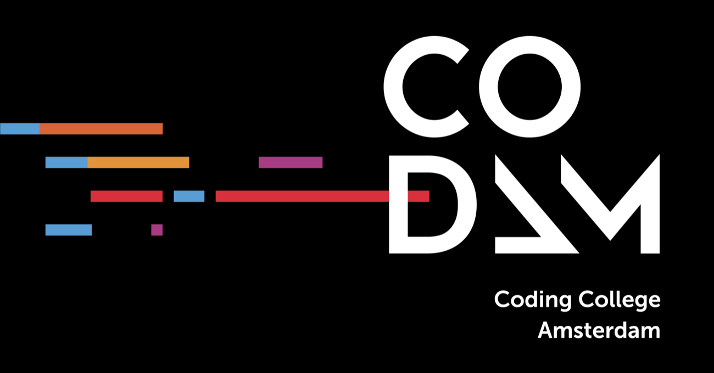

    
    

# Codam

This repo contains all of my projects done while following the [Codam](https://codam.nl/en) curriculum.

Codam is part of the [42 Network](https://www.42network.org/), which started with [42 Paris](https://42.fr/en).

## Libft 

Reimplementations of a bunch of C standard library functions and some additional utility functons. These functions will be used throughout the rest of the curriculum.

## ft_printf 

A (very simplified) reimplementation of the standard `printf` function.
